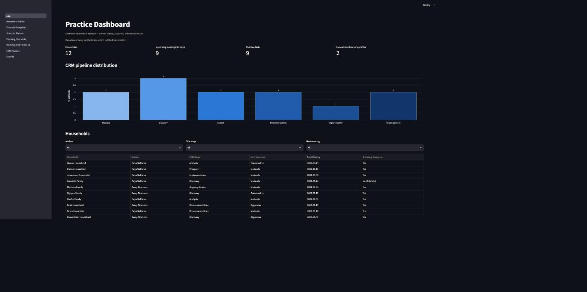
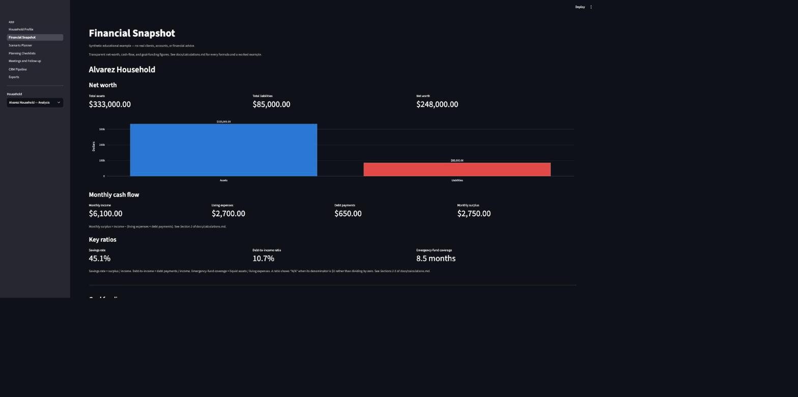
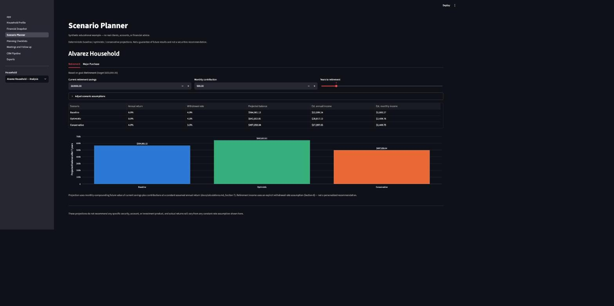
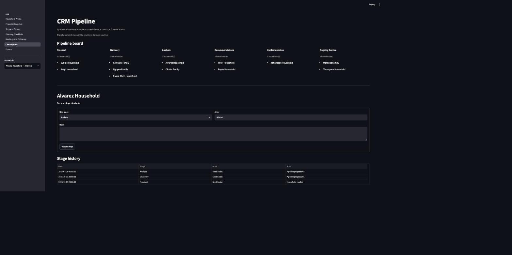

# Personal Financial Planning Practice Simulator

A local, synthetic-data simulator of the day-to-day workflow of a small
financial-planning practice: client discovery, organized financial records,
scenario analysis, meeting preparation, follow-up, and practice (CRM)
management.

> **This is an educational portfolio project, not a financial-advice
> product.** Every household, number, and note in this app is fictional and
> generated for demonstration purposes. Nothing here is personalized
> financial, tax, legal, or insurance advice, and the app does not connect to
> any real account, brokerage, or data provider.

## Screenshots

| Practice Dashboard | Financial Snapshot |
|---|---|
|  |  |

| Scenario Planner | CRM Pipeline |
|---|---|
|  |  |

## What it does

- **Practice dashboard** — household count, upcoming meetings, overdue
  tasks, incomplete discovery profiles, and CRM stage distribution, with
  filters by advisor, stage, and next meeting.
- **Household profile** — create/read/update/archive synthetic households;
  track members, financial facts, goals, notes, and a timestamped activity
  history.
- **Financial snapshot** — net worth, monthly cash flow, savings rate,
  debt-to-income ratio, emergency-fund coverage, and goal-funding progress,
  with every formula documented in [`docs/calculations.md`](docs/calculations.md).
- **Scenario planner** — deterministic baseline / optimistic / conservative
  projections for retirement balance & income and for a major-purchase goal,
  with adjustable return and withdrawal-rate assumptions shown explicitly on
  screen.
- **Planning checklists** — educational insurance, tax, estate, retirement,
  and emergency checklists (`Not reviewed` / `Needs follow-up` / `Complete` +
  notes), with a standing reminder that licensed professionals must review
  specialized advice.
- **Meetings & follow-up** — schedule meetings, auto-generate an agenda from
  missing discovery fields, open goals, and outstanding checklist items;
  record notes and recommendations; create and complete follow-up tasks.
- **CRM pipeline** — `Prospect → Discovery → Analysis → Recommendations →
  Implementation → Ongoing Service`, with a full stage-change history,
  stalled-household detection, and a practice-wide overdue-follow-up list.
- **Exports** — a formatted Excel advisor workbook (household summary,
  financial snapshot, goals & scenarios, checklists, meetings, tasks, audit
  history) and a clean, printable HTML client plan summary. Both are labelled
  **"Synthetic educational example"**.
- **Audit trail** — every data-changing action anywhere in the app writes an
  `audit_events` row (visible on the Household Profile page and inside the
  exported workbook).

## Technology

Python 3.12+, Streamlit, SQLite, pandas, openpyxl, Plotly, pytest. No
external APIs, no authentication, no cloud deployment, no AI features.

## Setup

```bash
# from the project root
python3 -m venv .venv
source .venv/bin/activate          # Windows: .venv\Scripts\activate
pip install -r requirements.txt

streamlit run app.py
```

Streamlit will open the Practice Dashboard in your browser (default
`http://localhost:8501`). On first run it creates `data/practice.db` and
seeds it with 12 synthetic households automatically — no setup script to
run by hand.

To start over with a fresh set of synthetic households, stop the app and
delete the database file:

```bash
rm data/practice.db
streamlit run app.py
```

### Running the tests

```bash
pytest
```

This runs unit tests for every calculation, model-layer CRUD/CRM/audit
behavior, seed-data reproducibility, Streamlit page smoke tests (via
`streamlit.testing.v1.AppTest`), and one end-to-end integration test that
walks a household through discovery, financial snapshot, scenario planning,
checklists, a meeting, a follow-up task, CRM progression, and both exports.

## A 5-minute demo script

1. **Dashboard** — open the app. Point out the household count, upcoming
   meetings, overdue tasks, and the CRM funnel chart. Filter households by
   advisor or stage.
2. **Household Profile** — pick a household (e.g. *Kowalski Family*, which is
   intentionally missing liabilities and goals). Show the activity history
   at the bottom — every field change is logged.
3. **Financial Snapshot** — switch to a complete household (e.g. *Rivera-Chen
   Household*). Walk through net worth, cash flow, savings rate, DTI, and
   emergency-fund coverage, and note they're all documented in
   `docs/calculations.md`.
4. **Scenario Planner** — show the baseline/optimistic/conservative
   retirement projection, then expand "Adjust scenario assumptions" to
   change the annual return live and watch the chart update.
5. **Planning Checklists** — mark an item "Needs follow-up" with a note.
6. **Meetings & Follow-up** — schedule a meeting and show the
   auto-generated agenda pulling in that same checklist item, then create a
   follow-up task and mark it complete.
7. **CRM Pipeline** — open *Alvarez Household*, a household seeded as
   "stalled" (no stage change in 75+ days) to show the stalled-household
   detector, then advance its stage and show the new history row.
8. **Exports** — download the Excel workbook and preview the HTML plan
   summary; point out the "Synthetic educational example" label on both.

## Project layout

```
app.py                     # Practice Dashboard (Streamlit entry point)
pages/                     # one file per additional page, in nav order
src/
  db.py                    # SQLite schema + connection helpers
  models.py                # all CRUD / CRM / audit / dashboard logic
  calculations.py           # pure financial formulas (no DB access)
  seed_data.py              # 12 synthetic household definitions
  exports.py                 # Excel workbook + HTML plan summary generation
  ui_common.py              # shared Streamlit helpers (palette, formatting)
tests/                     # pytest suite (unit, model, seed, page, e2e)
docs/calculations.md        # every formula, documented with a worked example
```

## Limitations

- **Not financial advice.** All projections are deterministic, constant-rate
  estimates shown with their assumptions explicit on screen — never a
  guarantee, a security recommendation, or a substitute for a licensed
  professional.
- **Single-user, local-only.** No authentication, no multi-advisor
  permissions, no concurrent-write protection beyond SQLite's own locking.
- **No real market or tax data.** Scenario assumptions are illustrative
  defaults an advisor can override per goal, not live rates.
- **No real client data has ever touched this repository.** All 12
  households, names, and figures are fictional.

## Resume-safe description of this project

> Built a Python, Streamlit, SQLite, and Excel simulator for client
> discovery, financial snapshots, goal scenarios, meeting preparation, and
> follow-up across 12 synthetic households. Developed transparent
> retirement, cash-flow, debt, and goal-funding analyses with auditable CRM
> stages, advisor tasks, planning checklists, and client-ready exports.

This project does not represent real clients, licensed financial planning
work, production use, or measured business impact.
